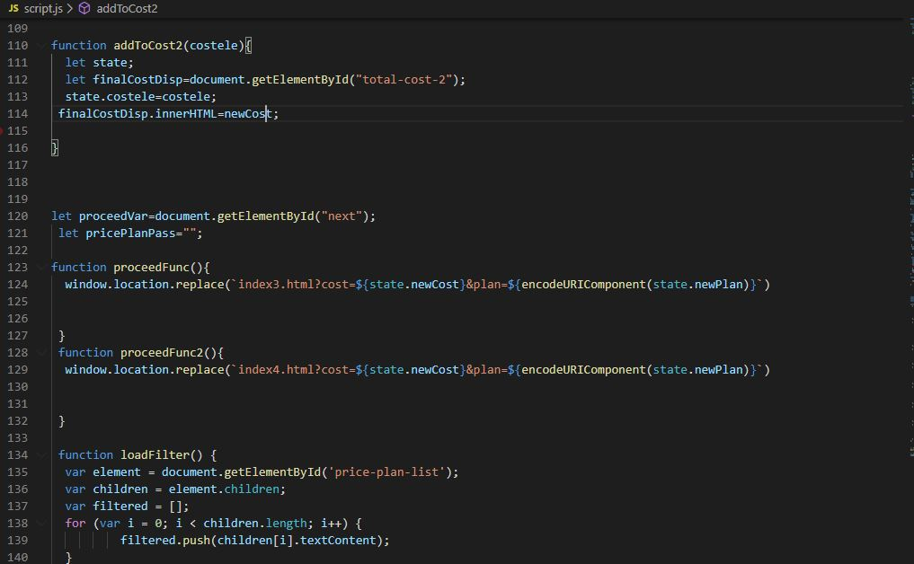
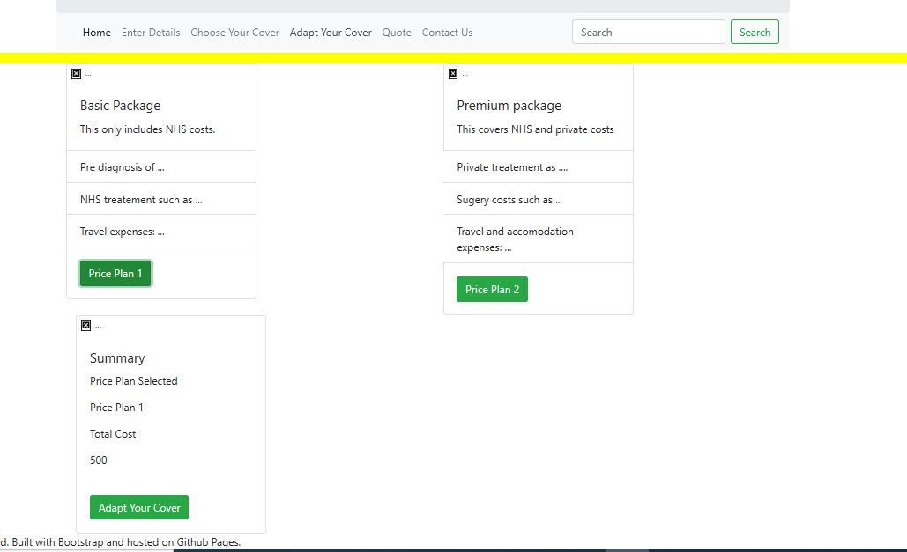
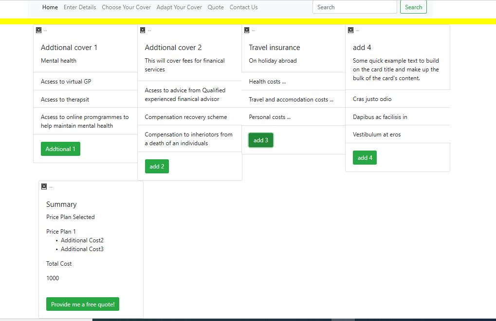

<h1>Final project on TTA1 (Generation course)</h1>

This project was made as a part of the Tech Talent Accelerator provided by Generation UK. The course consisted of daily coding practice and education plus learning about soft skills reuqired to be a good developer. I started this course 6 weeks ago with no knowledge on JavaScript, CSS and HTML and will be leaving with great knew skills and knowledge and contacts with some great people!

<h2>How to run the project I.e. npm install && npm start</h2>

<h2>Here some screen shot of my software</h2>

<h2>How to use it</h2>

Once you select the price plan want to cover this will be automatically added to the Summary card which will also show the cost

The button proceed to next will pass the data on to the next page the (additional cover) and present the data on the summary card

This page is the addtional cover, once the client selects the button  any of the button (add 1, add 2,add 3,add 4) this will be presented on the summary along with the data selected on the previous page (price plan).

This will then add the total costs of all price plan and addational costs and provide a total 

The button (provide me a free quote) will pass the data on to the next ppage the (Quote) page and present all selceted data on the summary card

<h2>Why did I make this?</h2>

During this Pandemic i relaised there has been no pandemic inssurance cover as of yet!, health insurance dealing with the pandemic in specific.

So i made a website that covers all of this:

All the legal documents such as disclaimers, disclosure, contracts, statutory provisons, Trademark and others are still under process.

<h2>Reading this Non disclosure agreement means you are agreeing to all the Terms and Condtions of GPRI and agree to the non disclosure forms. </h2>
 

This project i am just focusing on the software, building the website that will provide a quote

Home page will contain brief information about the insurance comapny

Enter details page is about creating a risk score by completing the questionnair which will generate a risk score which i will then add the risk score pass data to the next page the (chose your cover) using JS and Jquery. But this will not show the risk present to the client. (This is something i am still working on

Choose your cover page, will be a seclected fixed price plan which will be added pass the data to the overall summary on the same page and the next page using JS. (Sucessfuly was able to do)(/p)

Adjust your cover page, has same fucntion, this will add to the summary of what the client has choosen to cover thier personalised insurance as well the the total cost. Again pass the data to next page the Quote page using JS and Jquery.
 

Quote page, this will contain data from previous pages the client has choosen and using JS, will generate a quote by using a riskCalc which will take in account the risk score, costs of covers choosen, againts time (12 months one year).

Client can choose to pay anuually or monthly will have 2 different card with 2 different button one for annuanlly and one for monthly.

Contact us I will create a Form requiring User input.
 

<h2>Things that this project shows off:</h2>

 CSS, the font styling and smooth process of it all using bootsrap

Use of reusable code if later want to develop websites simillar to this commerical context and can use this
 

<h2>Link to my Website:</h2>

<h3>Thankyou for your time, hope you enjoyed using my website!</h3>

<h3>Contact Me:</h3>

Linkedin: Tasbiapretty
